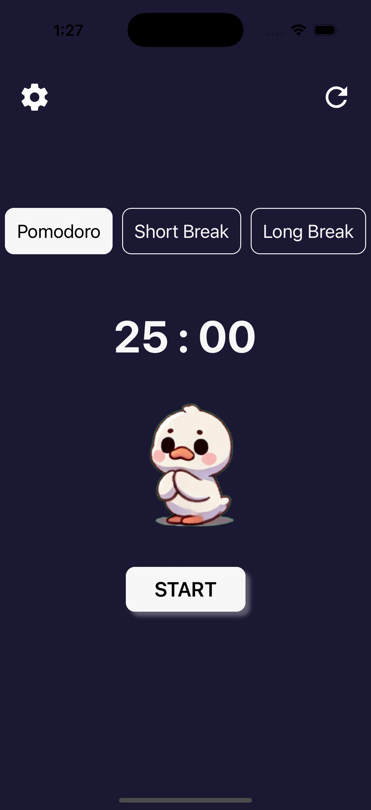
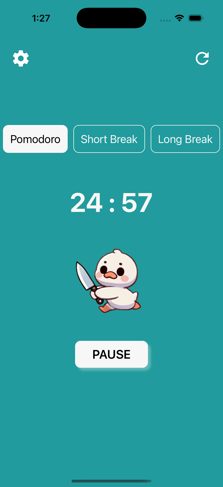
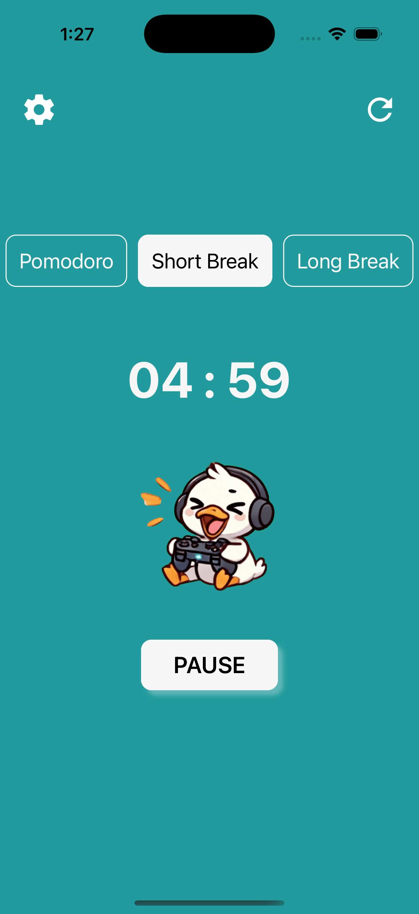
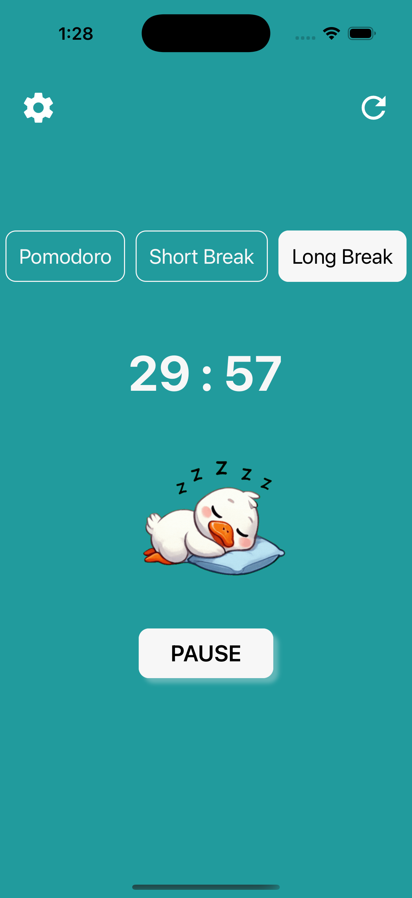
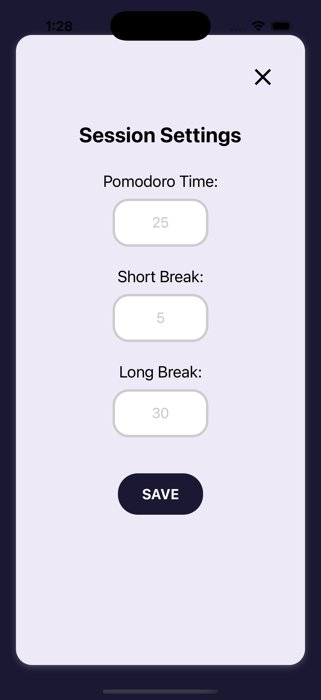

# Quackodoro
Boost your productivity with a Pomodoro timer - and a duck who won’t let you quit! 

## Objective

Quackodoro was a fun way for me to learn React Native, but I also added my own fun and chaotic twist by introducing a motivating duck that scares you with a knife instead of pom-poms! The duck also reacts to the different break session - during short breaks, it plays games while you rest, and for long breaks, it takes a well-deserved nap. It was a fun idea that challenged me, and the result is an engaging Pomodoro timer that helps you stay focused while being entertained by the duck's antics.

## Technology Learnt 

- **React Native**: Cross-platform app development (iOS, Android, Web)
- **Expo**: Simplified development environment for building React Native apps

---

## Screenshots
Landing Page:

Study Session:

Short Break:

Long Break:

Settings Page

## Demo Videos

Check out the demos for Quackodoro on different platforms:

- [Android Demo Video](screenshots/AndroidDemo.mp4)
- [iOS Demo Video](screenshots/iOSDemo.mp4)
- [WebApp Demo Video](screenshots/WebAppDemo.mp4)

## Future Scope

1. **Sound Effects**: Adding fun or motivational sound effects.
2. **Auto-Transition Between Session Tabs**: Automatically switching between study and break modes after a session ends.
3. **Backend for Statistics**: Implementing a backend to log statistics like streaks and total hours studied.
4. **Background Noise Options**: Letting users choose soothing background sounds (like rain, café noises, etc.) during study sessions.
5. **Distraction Blocker**: Enabling an option to block distracting apps during study sessions.
6. **Task List**: Allowing users to create a task list for each Pomodoro session.
